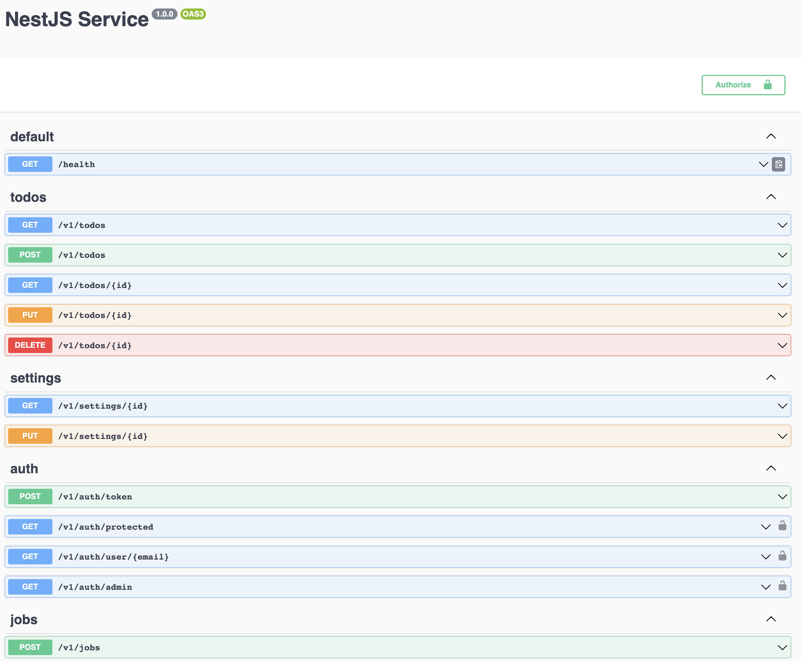

# NestJS Node API

Showcasing NestJS in a modern Node.js project.

### Run the app

- `docker compose up -d`
- Visit [http://localhost/documentation](http://localhost/documentation)

## Technologies

### Environment

- `Node.js`
- `Typescript`
- `pnpm`

### Libraries

- `Fastify`
- `Pino`
- `Zod`
- `Prisma`
- `Paseto`
- `Bull`
- `Jest`
- `ESLint`

### Services

- `Postgres`
- `Redis`

### Putting it all together

- `Docker`
